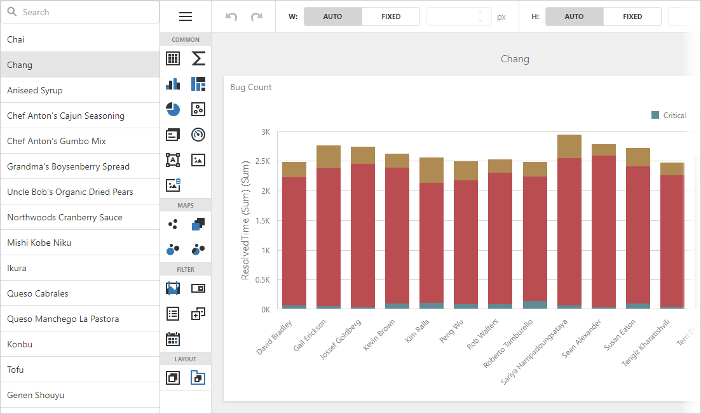

<!-- default badges list -->

[](https://supportcenter.devexpress.com/ticket/details/T1054393)
[](https://docs.devexpress.com/GeneralInformation/403183)
[](#does-this-example-address-your-development-requirementsobjectives)
<!-- default badges end -->
# Dashboard for Angular - How to Implement a Custom Service and UI for Managing Dashboards List

This example shows how to create a custom list of dashboards similar to the [Dashboard Panel](https://docs.devexpress.com/Dashboard/119771/web-dashboard/ui-elements-and-customization/ui-elements/dashboard-panel).



## Server

The [DevExtreme ASP.NET Data](https://github.com/DevExpress/DevExtreme.AspNet.Data) package's API is used to prepare a list of dashboard names with their IDs. Identifiers are based on the `Products` table from the `Northwind` database and accessed through the [Entity Framework Core](https://docs.microsoft.com/en-us/ef/core/). The `DashboardPanelController.Dashboards` action method call returns this list.

You need to implement the custom [dashboard storage](https://docs.devexpress.com/Dashboard/DevExpress.DashboardWeb.IDashboardStorage) to store dashboards. Call the [IDashboardStorage.LoadDashboard](https://docs.devexpress.com/Dashboard/DevExpress.DashboardWeb.IDashboardStorage.LoadDashboard(System.String)) method to return the corresponding dashboard from this storage. This example uses a single dashboard XML template (the `DashboardTemplate.xml` file) and only modifies the dashboard's title to emulate different dashboards. In this particular usage scenario, you can store dashboard layouts in the database and load them from here (for example, see [Dashboard for ASP.NET Core - How to load and save dashboards from/to a database](https://github.com/DevExpress-Examples/asp-net-core-dashboard-save-dashboards-to-database)).


## Client

The [dxList](https://js.devexpress.com/Documentation/ApiReference/UI_Components/dxList/) widget is used to load and display the list of dashboards. The [searchEnabled](https://js.devexpress.com/Documentation/ApiReference/UI_Components/dxList/Configuration/#searchEnabled) option of this widget is enabled to allow search. You can use other widget options to enable the required functionality. For example, the [itemDragging.allowReordering](https://js.devexpress.com/Documentation/ApiReference/UI_Components/dxSortable/Configuration/#allowReordering) option allows end users to reorder items (see [Item Dragging](https://js.devexpress.com/Demos/WidgetsGallery/Demo/List/ItemDragging/Angular/Light/)).

> **NOTE:** This example uses the `ProductID` database field as a dashboard's ID. The field's type is `number` while the [DashboardInfo.ID](https://docs.devexpress.com/Dashboard/DevExpress.DashboardWeb.DashboardInfo.ID) property and the [IDashboardStorage.LoadDashboard](https://docs.devexpress.com/Dashboard/DevExpress.DashboardWeb.IDashboardStorage.LoadDashboard(System.String)) method's argument type is `string`. It is necessary to convert types. In this example, this is done in the `NorthwindContext.OnModelCreating` method (see [NorthwindContext.cs](./asp-net-core-server/Models/NorthwindContext.cs)).

## Files to Review

* [Startup.cs](./asp-net-core-server/Startup.cs)
* [DashboardPanelController.cs](./asp-net-core-server/Controllers/DashboardPanelController.cs)
* [CustomDashboardStorage.cs](./asp-net-core-server/Code/CustomDashboardStorage.cs)
* [Product.cs](./asp-net-core-server/Models/Product.cs)
* [NorthwindContext.cs](./asp-net-core-server/Models/NorthwindContext.cs)
* [app.component.ts](./dashboard-angular-app/src/app/app.component.ts)
* [app.component.html](./dashboard-angular-app/src/app/app.component.html)

## Quick Start

### Server
Run the following command in the **asp-net-core-server** folder:

```
dotnet run
```

The server starts at `http://localhost:5000` and the client gets data from `http://localhost:5000/api/dashboard`. To debug the server, run the **asp-net-core-server** application in Visual Studio and change the client's `serverUrl` property according to the listening port: `https://localhost:44396/`.

See the following section for information on how to install NuGet packages from the DevExpress NuGet feed: [Install DevExpress Controls Using NuGet Packages](https://docs.devexpress.com/GeneralInformation/115912/installation/install-devexpress-controls-using-nuget-packages).

> This server allows CORS requests from _all_ origins with _any_ scheme (http or https). This default configuration is insecure: any website can make cross-origin requests to the app. We recommend that you specify the client application's URL to prohibit other clients from accessing sensitive information stored on the server. Learn more: [Cross-Origin Resource Sharing (CORS)](https://docs.devexpress.com/Dashboard/400709)

### Client
In the **dashboard-angular-app** folder, run the following commands:

```
npm install
npm start
```

Open ```http://localhost:4200/``` in your browser to see the Web Dashboard application.

## Documentation

- [Prepare Dashboard Storage](https://docs.devexpress.com/Dashboard/16979/web-dashboard/dashboard-backend/prepare-dashboard-storage)

## More Examples

- [Dashboard for ASP.NET Core - How to Implement a Custom Service and UI for Managing Dashboards List](https://github.com/DevExpress-Examples/asp-net-core-dashboard-custom-panel)
- [Dashboard for ASP.NET Core - How to load and save dashboards from/to a database](https://github.com/DevExpress-Examples/asp-net-core-dashboard-save-dashboards-to-database)
<!-- feedback -->
## Does this example address your development requirements/objectives?

[](https://www.devexpress.com/support/examples/survey.xml?utm_source=github&utm_campaign=angular-dashboard-custom-panel&~~~was_helpful=yes) [](https://www.devexpress.com/support/examples/survey.xml?utm_source=github&utm_campaign=angular-dashboard-custom-panel&~~~was_helpful=no)

(you will be redirected to DevExpress.com to submit your response)
<!-- feedback end -->
